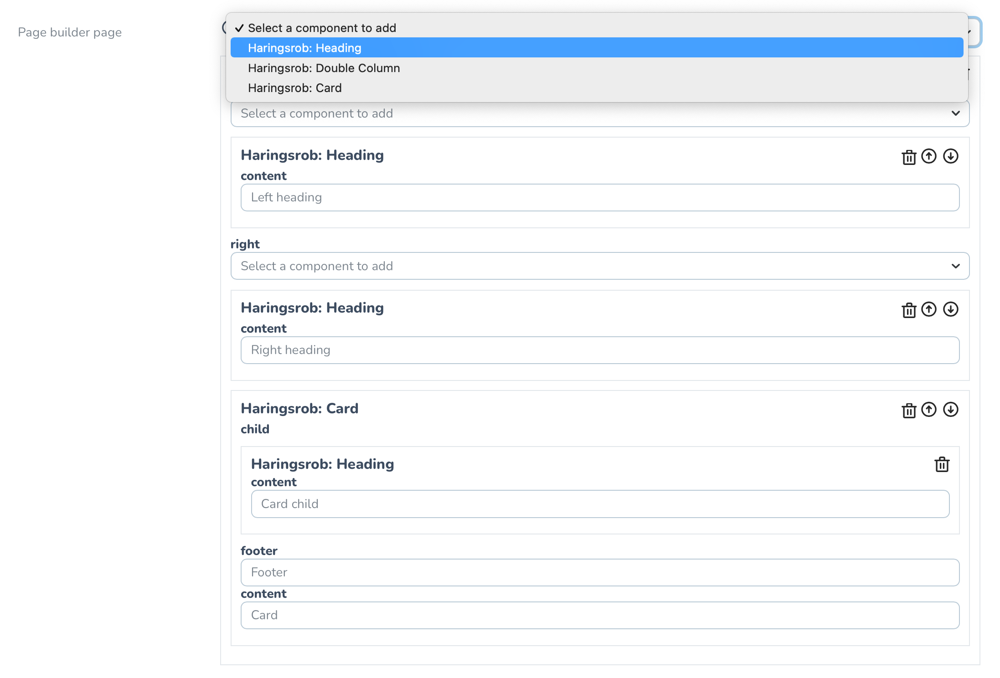
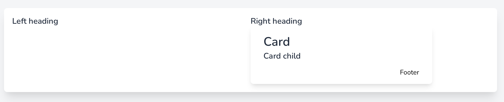

# Laravel Nova page builder

[](https://packagist.org/packages/haringsrob/laravel-page-builder)

Laravel page builder is a package for Laravel that allows you to easily construct
pages using a customer [Laravel Nova](https://nova.laravel.com) field and Laravel Blade components.

I made this package as I like the idea of page builders, but I really dislike the idea
of unstructured data or html stored in the database.

I want to have the ability to define components easily (blade) and stick with how
I would make regular templates. In addition to that, I want to have the ability to modify
the components I create when a visual change is needed, without needing to rebuild the page.

The contents of the page builder are stored in a structured json object.

The package provides a few example components, but components should still be added by
your project.

**Disclaimer:** This package is a prototype/under development,
feel free to use it and provide feedback or  pull requests to help improve it.

## Installation

You can install the package via composer:

```bash
composer require haringsrob/laravel-page-builder
```

### Creating a component

A page builder component is an extension from a regular component.

You can start by creating your component using the command line (provided by Laravel):

`php artisan make:component ExamplePageBuilderComponent`

After that, modify the component so that it extends a BuilderComponent:

```php
<?php

namespace App\View\Components;

use Haringsrob\LaravelPageBuilder\View\BuilderComponent;
use Illuminate\Contracts\View\View;

class ExamplePageBuilderComponent extends BuilderComponent
{
    private string $textLeft;
    private string $textRight;

    public function __construct(string $textLeft, string $textRight)
    {
        $this->textLeft = $textLeft;
        $this->textRight = $textRight;
    }

    static public function getForm(): array
    {
        return [
            'textLeft' => BuilderComponent::TYPE_TEXT,
            'textRight' => BuilderComponent::TYPE_TEXT,
        ];
    }

    public function render(): View
    {
        return view(
            'components.example-page-builder-component',
            [
                'textLeft' => $this->textLeft,
                'textRight' => $this->textRight,
            ]
        );
    }
}
```

As you can see it is very similar to regular components, except that there is a
getForm method and optionally a renderForBuilder method.

For now there are a couple of hardcoded types that the form builder supports:

```php
public const TYPE_CHILDREN = 'children';
public const TYPE_CHILD = 'child';
public const TYPE_TEXT = 'text';
public const TYPE_WYSIWYG = 'wysiwyg'; // @todo: To be implemented.
```

The builder supports infinite nesting, and you can use the text fields for anything you want
(such as classes, or icon names).

The rendering of the component is done by you using regular blade files.

By properly structuring the files, you can continue to use them without involving the
page builder.

### Adding the field to a Laravel Nova

Internally there is a `PageBuilderPage` model, that holds the json structure of the page
builder field.

There is also a trait you can use to make your model working with the page builder.

For example if you have a `Page` model, you can add `use HasPageBuilder;` to define the
relation.

After adding the trait, you should add a migration to your Page table:

```php
$table->unsignedBigInteger('page_builder_page_id')->nullable();
$table->foreign('page_builder_page_id')->references('id')->on('page_builder_pages');
```

Now with all this, in your Nova resource add the field to the fields list:

```php
LaravelPageBuilderField::make('Page builder page', 'page_builder_page_id'),
```

Now in the controller where you display the page you add:

```php 
public function page(Page $page): View
{
    return view('page', ['structure' => $page->pageBuilderPage->toStructureCollection(), 'title' => $page->title]);
}
```

And in the blade component:

```html
<html>
<title>{{ $title }}</title>
</html>
<x-laravel-page-builder-builder-content :content="$structure"></x-laravel-page-builder-builder-content>
```

If all is set up correctly, the page builder should be available in Nova with the components
you created, and the ones provided by this package:

The ui:


This produces the following:


* I must admit, the ui can be improved quite a lot, but as this is a first prototype it works
great!

## Contributing

Please see [CONTRIBUTING](CONTRIBUTING.md) for details.

### Testing

The package does contain a couple of tests but this is still under progress and more should
be added.

### Security

The components are rendered in blade with allowing html: `{!! !!}`, please take actions
required in your own implementations to ensure no xss is possible.

If you discover any security related issues, please email rob@harings.be instead of using the issue tracker.

## License

The MIT License (MIT). Please see [License File](LICENSE.md) for more information.

# todo:

- [ ] Allow to whitelist/blacklist blade-x components for the builder ui.
- [ ] Improve the ui for the page builder.
- [ ] Add the wysiwyg text field type in the builder.
